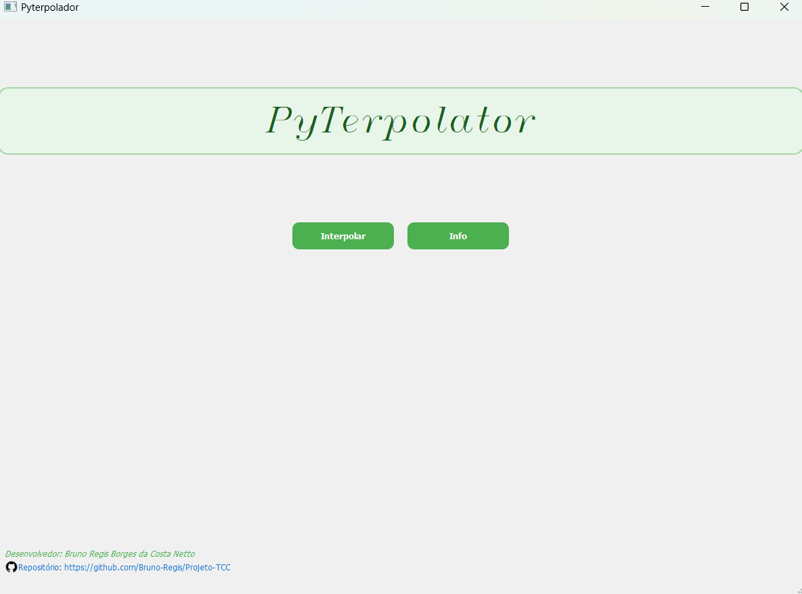
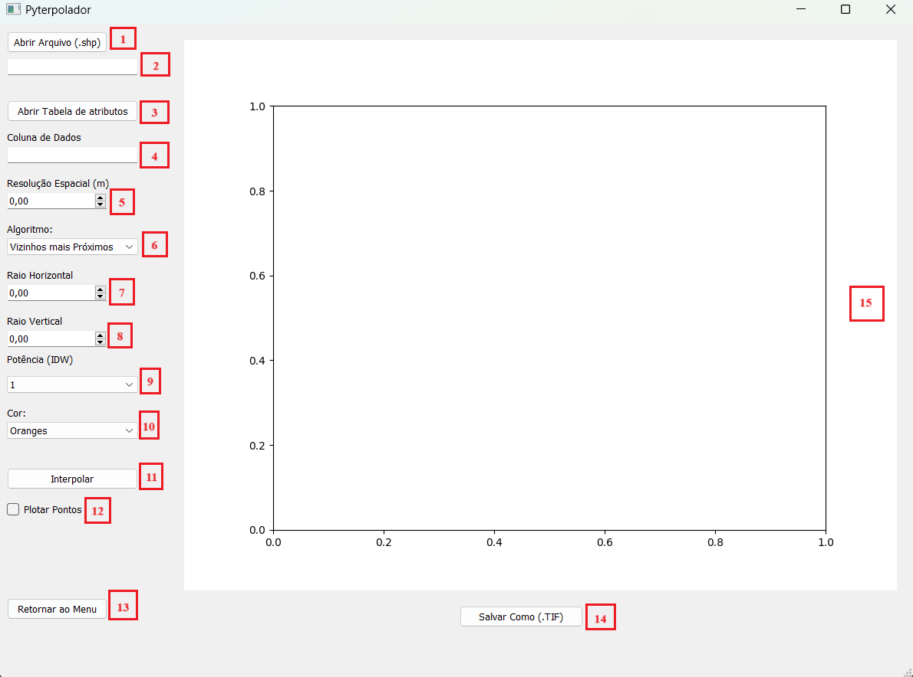
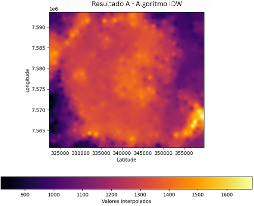

# DESENVOLVIMENTO DE SOFTWARE DE INTERPOLAÇÃO GEOESPACIAL - UNIVERSIDADE FEDERAL DE ALFENAS - DEZEMBRO DE 2024

## Resumo
 Este trabalho de conclusão de curso tem como objetivo criar um software no back-end e no front
end, de interpolações espaciais, utlizando a linguagem de programação Python, que apresente
 visualizações para o usuário e permite a exportação de arquivos de imagem contendo dados
 georreferenciados para a posterior utilização em Sistemas de Informação Geográfica (SIG).
 Foram elaborados algoritmos que realizam os métodos de interpolação Inverso do Ponderado
 pela Distância (IDW), os Vizinhos Mais Próximos e a Média Móvel. A aplicação desenvolvida
 foi nomeda como Pyterpolator, ela se destaca por apresentar uma interface gráfica de fácil
 entendimento, desenvolvida utilizando a biblioteca PyQt5, proporcionando uma experiência
 intuitiva e permitindo o uso do sistema sem a necessidade de conhecimentos técnicos avançados.
 OPyterpolator alcançou um bom desempenho com uma interface gráfica de fácil manuseio. O
 seu desenvolvimento foi focado em apresentar um código limpo, modular e de fácil manutenção,
 atendendo às boas práticas de programação. O trabalho tem como proposta, a criação de uma
 aplicação de código aberto que permite aos usuários de diferentes níveis de conhecimento
 técnico compreender o processo de desenvolvimento de software e sua aplicação no campo de
 geoprocessamento. Keywords: Python. algoritmos. interpolação, desenvolvimento de software

## Interface Inicial

## Interface de Interpolação

## Interface Teórica

 
## Resultados (Pontos Amostrais da Caldeira Vulcânica de Poços de Caldas - MG)

## Comparação do Resultado obtido no Pyterpolator com o interpolador nativo do QGIS

